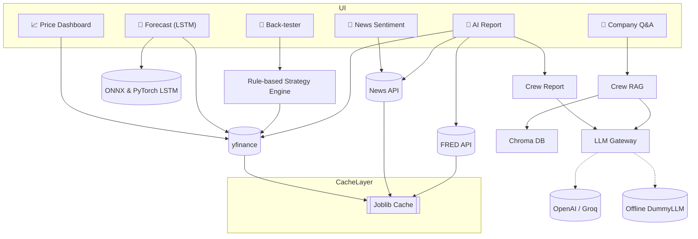
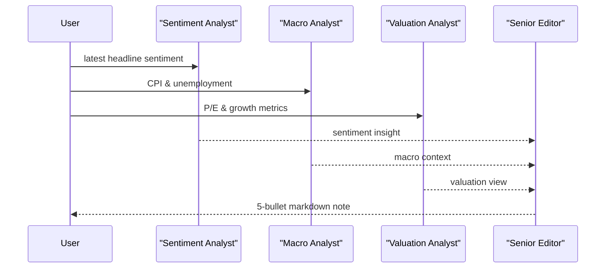
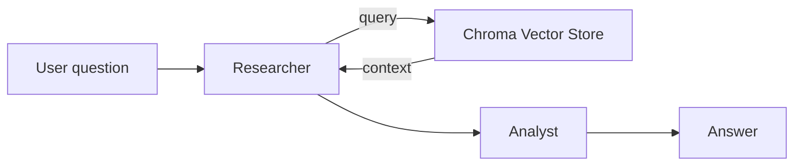

# AI-Powered Trading Intelligence Platform 🧠📈  
*An end-to-end lightweight research cockpit that ingests market & macro data, synthesises insights with multi‑agent LLMs, and lets you **test or forecast** trading ideas – all from a single Streamlit UI.*

---

🚀 **[Live Demo](https://quantum-trading-intelligence.streamlit.app/)** 

---

## 📌 Table of Contents
1. [Project Overview](#project-overview)  
2. [High‑Level Architecture](#high-level-architecture)  
3. [🔄 Agent Workflow Diagrams](#agent-workflow-diagrams)  
4. [Technology Stack](#technology-stack)  
5. [Project Structure](#project-structure)  
6. [Setup & Installation](#setup--installation)  
7. [Usage Guide](#usage-guide)  
8. [Component Documentation](#component-documentation)  
9. [API‑Ready Functions](#api-ready-functions)  
10. [Real‑World Applications](#real-world-applications)  
11. [Contributing](#contributing)  
12. [Troubleshooting](#troubleshooting)

---

## Project Overview
| | |
|---|---|
| **Goal** | end‑to‑end pipeline → _data ingestion → analytics & forecasting → multi‑agent reasoning → trade simulation_. |
| **What you get** | • Live price dashboard   • News sentiment pie   • 4‑agent AI research note   • LSTM forecasting sandbox   • Rule‑based back‑tester   • Company Q&A chatbot |

---

## High‑Level Architecture


---

## Agent Workflow Diagrams

### 🤖 AI Report – 4‑Agent CrewAI Pipeline


### 💬 Company Q&A – 2‑Agent RAG Crew


---

## Technology Stack
| Layer | Tech |
|-------|------|
| UI / Viz | **Streamlit**, Plotly |
| Data wrangling | pandas, NumPy |
| Forecasting | PyTorch LSTM, scikit‑learn, XGBoost, ONNX |
| LLM orchestration | **LangChain**, **CrewAI**, OpenAI / Groq |
| Vector store | **ChromaDB** + MiniLM sentence‑transformers |
| Finance & macro APIs | yfinance, FRED, NewsAPI, Finnhub, PRAW |
| Strategy engine | vectorised mean‑reversion & SMA‑momentum |
| Ops & tooling | joblib cache, structlog, loguru, pytest, ruff, black |

---

## Project Structure
```
quantum-trading-intelligence
├─ app/
│  ├─ main.py
│  └─ pages/
│     ├─ 1_📈_Price_Dashboard.py
│     ├─ 2_📰_News_Sentiment.py
│     ├─ 3_🤖_AI_Report.py
│     ├─ 4_🔮_Forecast.py
│     ├─ 5_🧪_Backtest_Strategies.py
│     └─ 6_💬_Company_QA.py
├─ src/
│  ├─ agents/          # CrewAI pipelines
│  ├─ data/            # loaders & caching
│  ├─ knowledge/       # Chroma vector‑store
│  ├─ strategies/      # rule‑based strategies
│  ├─ ml/              # LSTM + ONNX models
│  └─ utils/           # LLM gateway, logging
└─ tests/              # 18 pytest cases
```

---

## Setup & Installation
```bash
git clone https://github.com/nsr789/quantum-trading-intelligence.git
cd quantum-trading-intelligence
python -m venv .venv && source .venv/bin/activate
pip install -r requirements.txt
cp .env.example .env     # add OPENAI_API_KEY / GROQ_API_KEY if you have them
streamlit run app/main.py
pytest -q                # ⇢ 18 passed
```

---

## Usage Guide
| Page | What you get |
|------|--------------|
| 📈 **Price Dashboard** | OHLCV chart & moving averages |
| 📰 **News Sentiment** | Tone breakdown of latest headlines |
| 🤖 **AI Report** | 5‑bullet multi‑agent GPT note (cached) |
| 🔮 **Forecast** | LSTM next‑day price + MAE / RMSE |
| 🧪 **Back‑tester** | Mean‑reversion & SMA momentum P&L |
| 💬 **Company Q&A** | RAG chatbot over vector store |

---

## Component Documentation
| Module | Purpose |
|--------|---------|
| `agents/crew_report.py` | 4‑agent CrewAI report generator (cached) |
| `ml/lstm.py` | PyTorch LSTM, exported to ONNX for fast inference |
| `agents/forecast.py` | Streamlit page wrapper for LSTM forecast |
| `knowledge/vectorstore.py` | Persistent Chroma collection (MiniLM) |
| `strategies/*` | Vectorised back‑test framework |
| `data/cache.py` | `joblib.Memory`, 24‑h TTL cache |

---

## API‑Ready Functions
| Function | Output | Description |
|----------|--------|-------------|
| `generate_report(ticker)` | `str` | 5‑bullet AI note (cached) |
| `forecast_price(ticker)` | `dict` | next‑day price ŷ, MAE, RMSE |
| `qa_with_crew(question, ticker)` | `str` | CrewAI RAG answer |
| `get_price_history(...)` | `DataFrame` | OHLCV via yfinance |
| `backtest(...)` | `dict` | equity curve & Sharpe |

---

## Real‑World Applications
* Sell‑side *“first‑look”* research assistant  
* Retail‑trader dashboard with AI commentary + forecast  
* Teaching lab for LLM & DL orchestration on modest hardware

---

## Contributing
1. Fork ➜ feature branch ➜ PR  
2. `ruff format && ruff --fix` before commit  
3. Ensure `pytest -q` passes

---

## Troubleshooting
| Issue | Fix |
|-------|-----|
| **429 RateLimit** | new key or wait – fallback still works |
| Chroma lock (Windows) | `export CHROMA_DB_IMPL=duckdb+parquet` |
| Pydantic warnings | harmless; upstream change |

---

*Happy trading & coding!* 🚀
