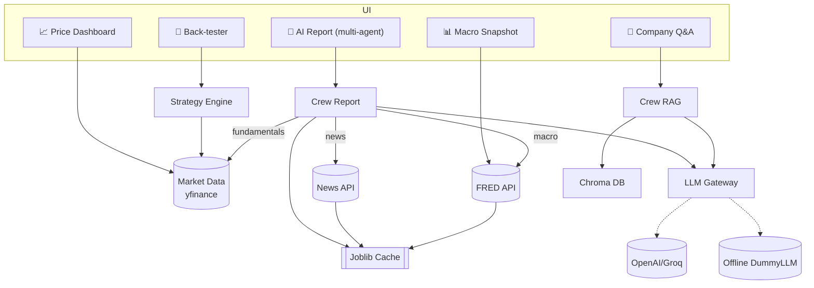
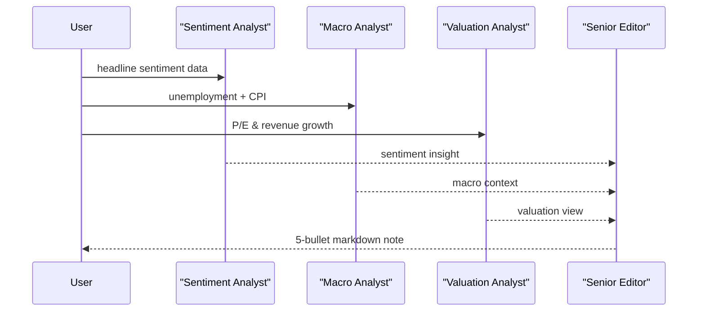
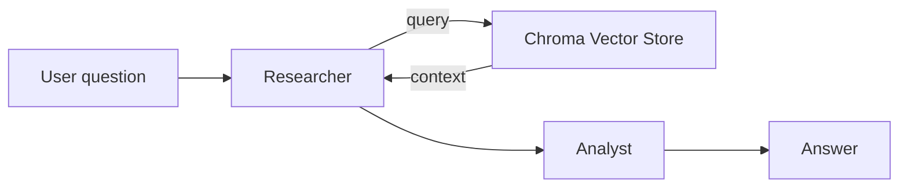

# Quantum Trading Intelligence 🧠📈  
*A lightweight research cockpit that ingests market & macro data, computes
signals, and orchestrates multi-agent LLM reasoning.*

---

## 📌 Table of Contents
1. [Project Overview](#project-overview)  
2. [High-Level Architecture](#high-level-architecture)  
3. [🔄 Agent Workflow Diagrams](#agent-workflow-diagrams)  
4. [Technology Stack](#technology-stack)  
5. [Project Structure](#project-structure)  
6. [Setup & Installation](#setup--installation)  
7. [Usage Guide](#usage-guide)  
8. [Component Documentation](#component-documentation)  
9. [API-Ready Functions](#api-ready-functions)  
10. [Real-World Applications](#real-world-applications)  
11. [Contributing](#contributing)  
12. [Troubleshooting](#troubleshooting)

---

## Project Overview
| | |
|---|---|
| **Goal** | data ingestion ➜ analytics ➜ multi-agent LLM output. |
| **Features** | • Live price dashboard   • Macro snapshot   • Multi-agent GPT research note   • Strategy back-tester   • Company Q&A RAG chatbot |

---

## High-Level Architecture


---

## Agent Workflow Diagrams
### 🤖 AI Report — 4-Agent CrewAI Pipeline


### 💬 Company Q&A — 2-Agent RAG Crew


---

## Technology Stack
| Layer | Tech |
|-------|------|
| UI / Viz | **Streamlit**, Plotly |
| Data wrangling | pandas, NumPy |
| ML / DL | scikit-learn, XGBoost, PyTorch, ONNX |
| LLM orchestration | **LangChain**, **CrewAI**, OpenAI / Groq |
| Vector store | **ChromaDB** + MiniLM sentence-transformers |
| Finance & macro APIs | yfinance, fredapi, NewsAPI, Finnhub, PRAW |
| Strategy engine | custom vectorised back-tester |
| Ops | joblib cache, structlog, loguru, pytest, ruff, black |

---

## Project Structure
```
quantum-trading-intelligence
├─ app/
│  ├─ main.py
│  └─ pages/
│     ├─ 1_📈_Price_Dashboard.py
│     ├─ 2_📊_Macro_Snapshot.py
│     ├─ 3_🤖_AI_Report.py
│     ├─ 4_🧪_Backtest_Strategies.py
│     └─ 5_💬_Company_QA.py
├─ src/
│  ├─ agents/          # CrewAI pipelines
│  ├─ data/            # loaders & caching
│  ├─ knowledge/       # Chroma vector-store
│  ├─ strategies/      # trading strategies
│  ├─ ml/              # ML models (ONNX)
│  └─ utils/           # LLM gateway, logging
└─ tests/              # 18 pytest cases
```

---

## Setup & Installation
```bash
git clone https://github.com/nsr789/quantum-trading-intelligence.git
cd quantum-trading-intelligence
python -m venv .venv && source .venv/bin/activate
pip install -r requirements.txt
cp .env.example .env              # add OPENAI_API_KEY / GROQ_API_KEY if available
streamlit run app/main.py
pytest -q                         # 18 passed
```

---

## Usage Guide
| Page | What you get |
|------|--------------|
| 📈 **Price Dashboard** | OHLCV visualization & indicators |
| 📊 **Macro Snapshot** | CPI, unemployment, Fed funds charts |
| 🤖 **AI Report** | 5-bullet multi-agent GPT note (cached) |
| 🧪 **Back-tester** | Mean-reversion & SMA momentum results |
| 💬 **Company Q&A** | RAG chatbot over Chroma context |

---

## Component Documentation
| Module | Purpose |
|--------|---------|
| `agents/crew_report.py` | 4-agent CrewAI note generator; uses news, macro, fundamentals; cached. |
| `utils/llm.py` | Provider-agnostic streaming (OpenAI, Groq, Dummy). |
| `knowledge/vectorstore.py` | Persistent Chroma collection; seeds small company corpus; MiniLM embeddings. |
| `strategies/*` | Vectorised back-test framework. |
| `data/cache.py` | `joblib.Memory`, 24‑h TTL cache. |

---

## API-Ready Functions
| Function | Output | Description |
|----------|--------|-------------|
| `generate_report(ticker)` | `str` | 5-bullet AI note (cached). |
| `qa_with_crew(question, ticker)` | `str` | CrewAI RAG answer. |
| `get_price_history(...)` | `DataFrame` | OHLCV via yfinance. |
| `backtest(...)` | `dict` | Equity curve & Sharpe. |

---

## Real-World Applications
* Sell-side *“first-look”* research assistant  
* Retail‑trader dashboard with AI commentary  
* Teaching lab for LLM orchestration on constrained hardware

---

## Contributing
1. Fork ➜ feature branch ➜ PR  
2. `ruff format && ruff --fix` before commit  
3. Ensure `pytest -q` passes

---

## Troubleshooting
| Issue | Fix |
|-------|-----|
| **429 RateLimit** | new key or wait; fallback still works |
| Import error `src` | `pip install -e .` |
| Chroma lock (Windows) | `export CHROMA_DB_IMPL=duckdb+parquet` |
| Pydantic warnings | harmless; upstream change |

---

*Happy trading & coding!* 🚀
